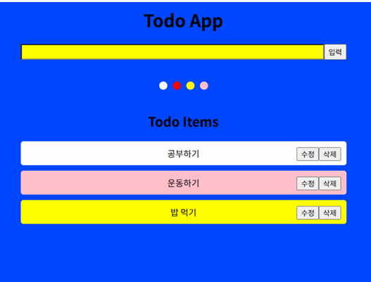

TodoApp

# Vite로 React 시작하기

### 설치

```
npm create vite@latest TodoApp -- --template react
cd TodoApp
npm install
```

### 실행

```
npm run dev
```

# TodoApp



1. 입력창 바로 밑에 색상들이 나열되어 있으며, 해당 색상을 클릭하면 input의 배경색이 변합니다.
2. 그 상태에서 입력 input 창에 글을 쓰고 입력을 클릭하면 아래 item이 추가됩니다.
3. 이때 추가되는 todo item의 배경색은 추가 당시에 선택되어 있는 배경색입니다.

hook(useEffect 등)을 사용하여 구현하시오.

## 심화

### 1. 컴포넌트 분리(props와 state 위치와 값은 임의로)

- TodoInput
- Colorbar(색 나열)
- TodoList(투두리스트 랜더링 영역)
  - Todo Item(투두 아이템 1개 렌더링 할 컴포넌트)

### 2. input 태그 하나 더 만들어서, 만들어진 Todo가 검색이 되도록.(필터링)

### 3. 현재는 새로고침시, 데이터가 사라짐. 새로고침해도 데이터가 사라지지 않도록(storage API 사용)

### 4. Todo List에서 삭제 버튼을 누르면 삭제되도록(map 시 key값을 기준으로 다시 그릴지 결정)

### 5. 수정하기 구현

### 6. ContextAPI를 사용하여 전역으로 관리할 수 있도록 하기.
